# 架构思路

在设计架构的时候，考虑最多的两个问题是：

- **要足够简单**，只在 Spring 上做简单封装，便于维护与升级。
- **以提高效率为主要目的**，要提高开发、程序执行、调试测试、安装部署、文档撰写等方面的效率。

框架定义在支撑一个 100 万并发的中形后台系统，不做更复杂的分布处理。

下面以京东的系统架构规划为例子，让后台框架设计时，有一个大的方向。

## 1. 架构愿景

### 1.1 架构目标

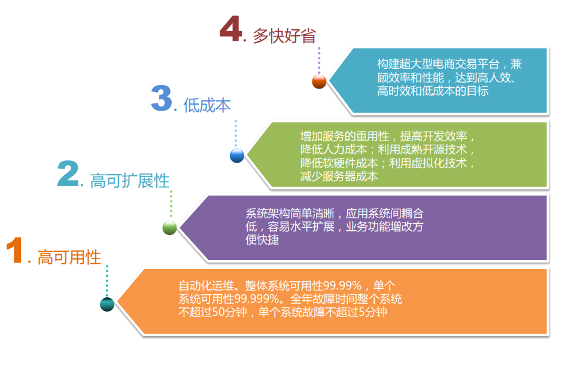

### 1.2 质量要求

### 1.3 总体原则

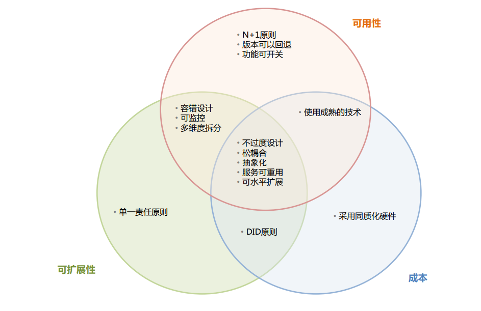

### 1.4 关键点

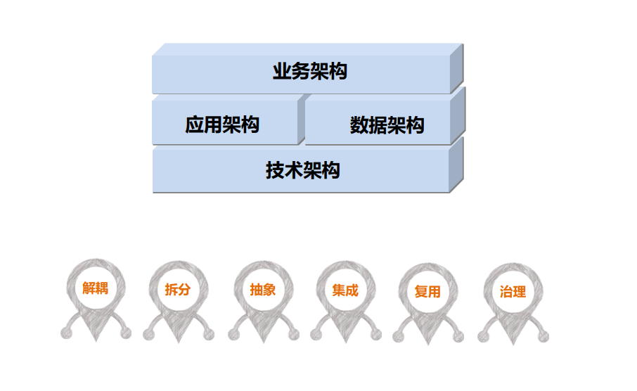

## 2. 业务架构

### 2.1 设计原则

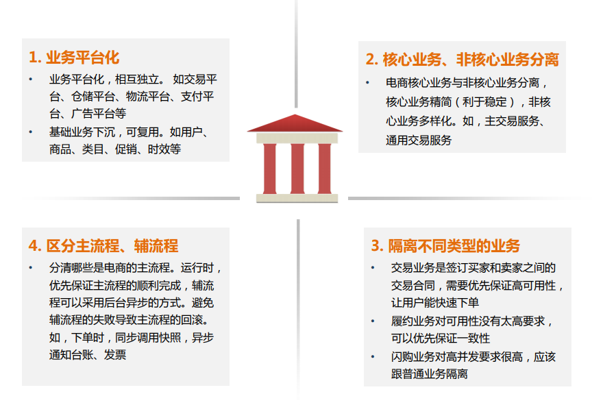

### 2.2 业务架构图

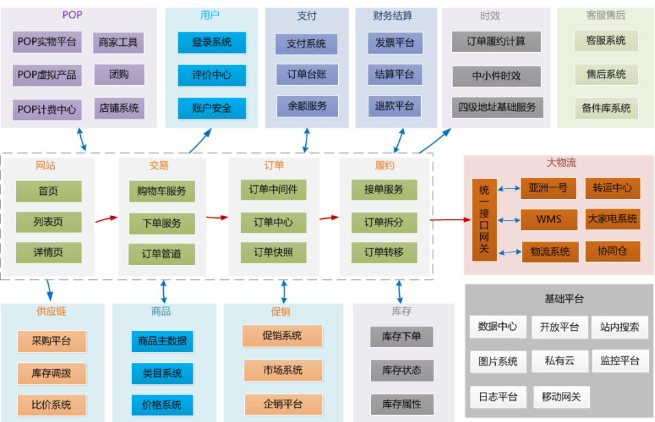

### 2.3 案例分析

**基础业务下沉**，这里把服务层进行了拆分，把基础服务层更加细化

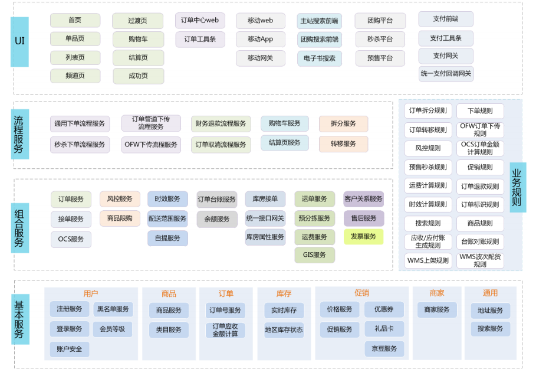

## 3. 应用架构

### 3.1 设计原则

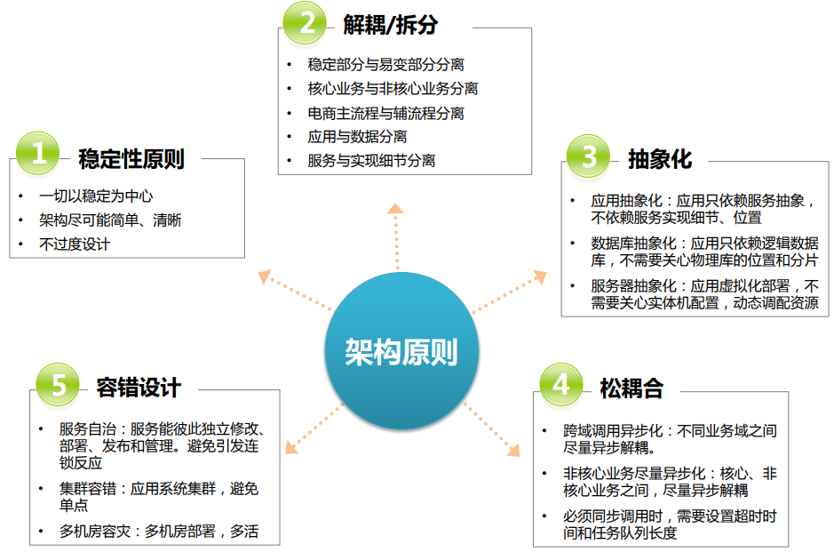

### 3.2 应用架构

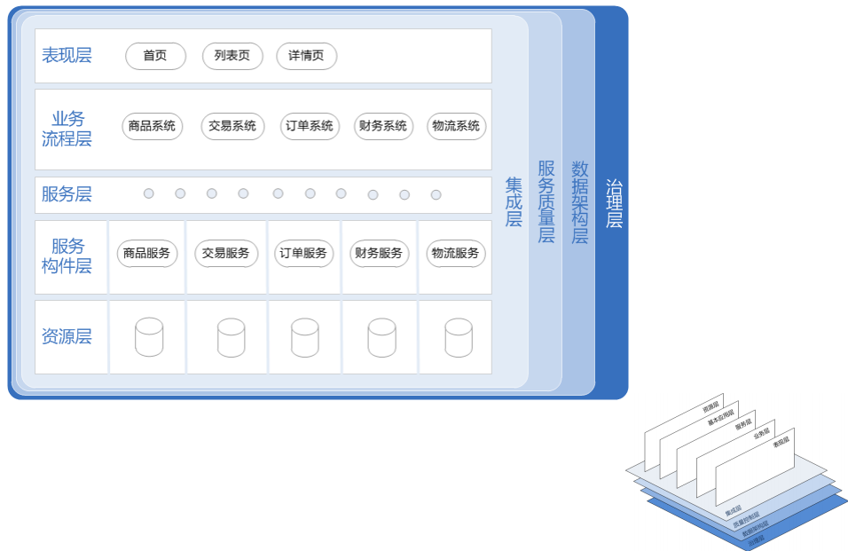

### 3.3 架构分析

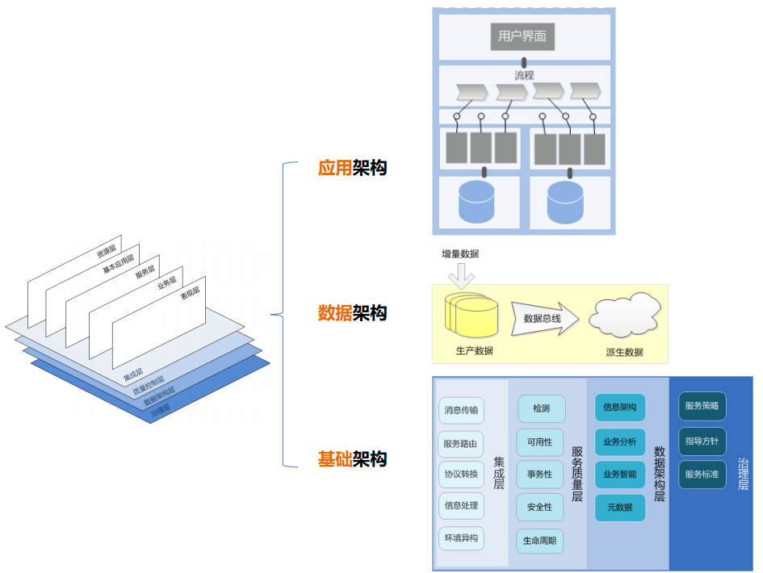

### 3.4 分解原则

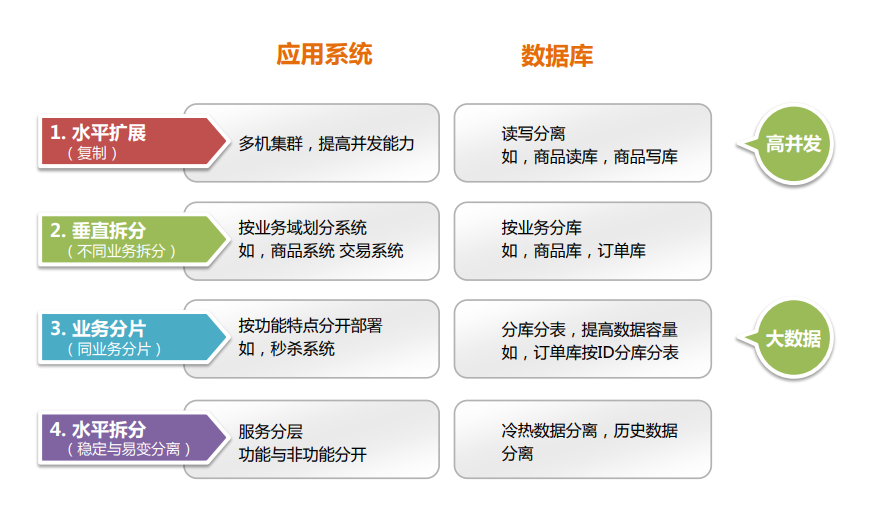

### 3.5 依赖原则

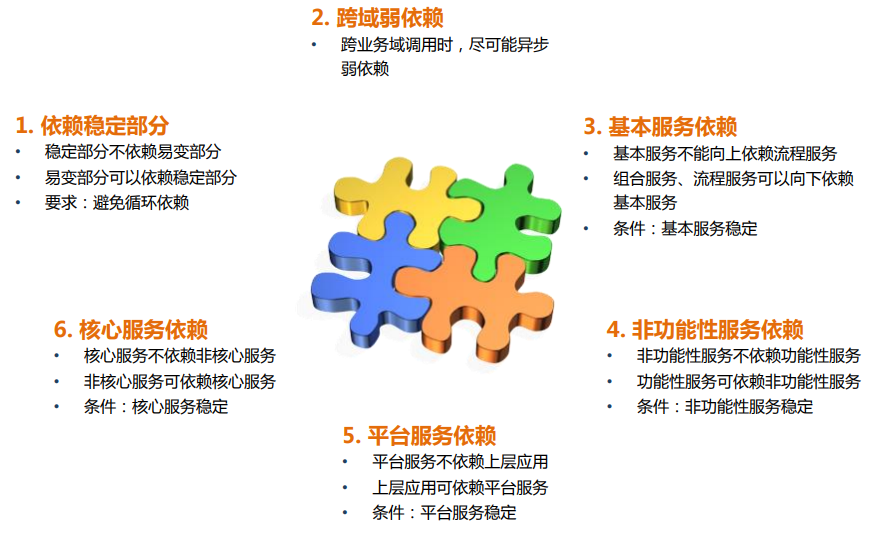

### 3.6. 服务设计原则

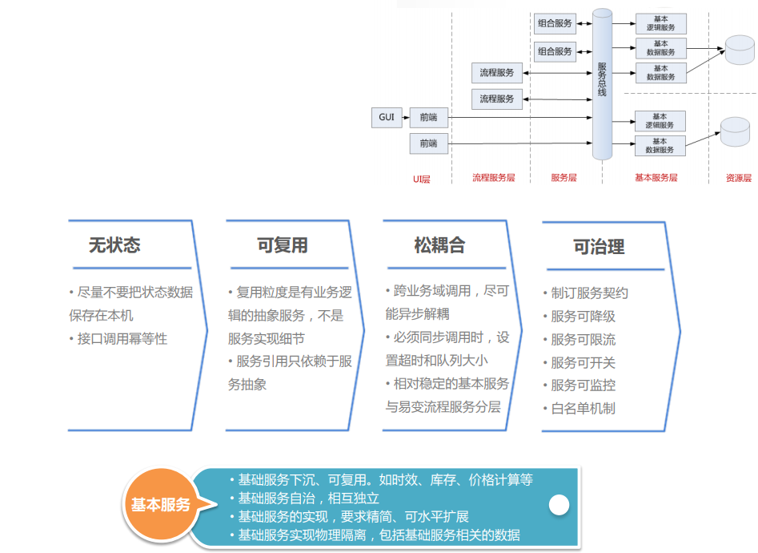

### 3.7 案例分析

交易订单。

【基本服务层】主要与资源层打交道，通俗简单的讲，就是与数据库、缓存、文件系统打交道。

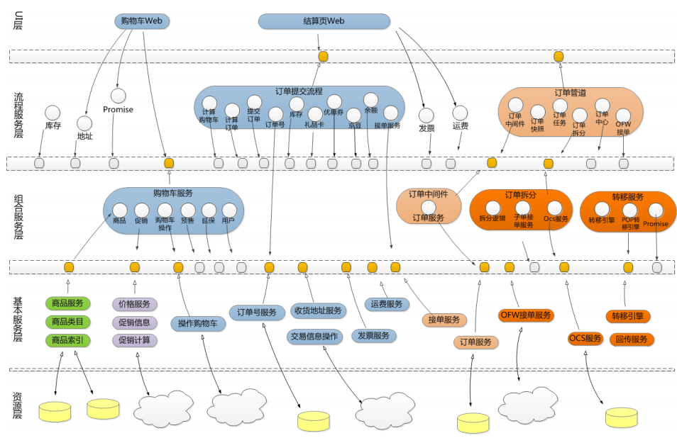

## 4. 数据架构

### 4.1 设计原则

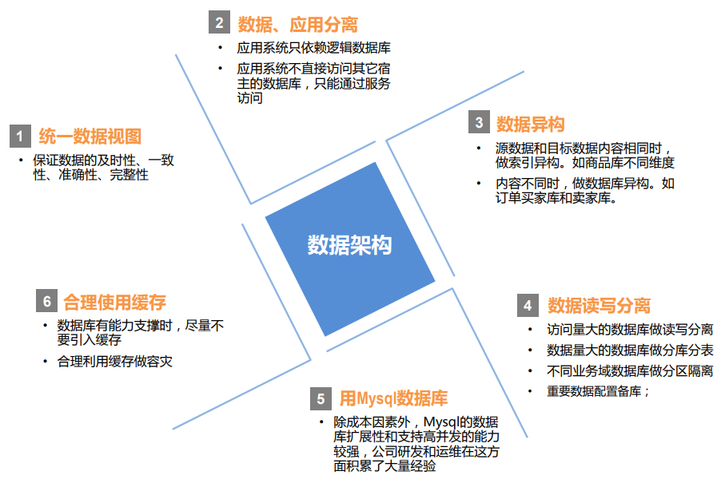

### 4.2 数据架构

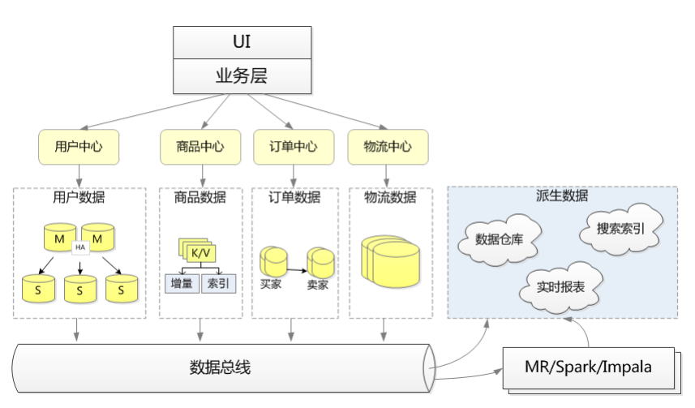

### 4.3 案例分析

> 数据架构实例：分布式索引系统

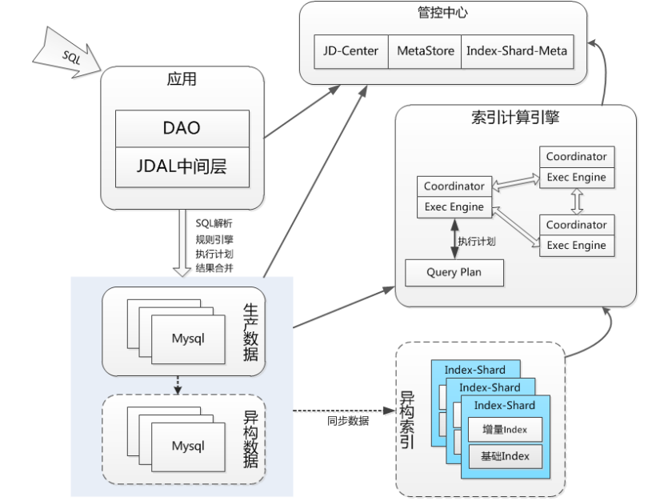

> 数据架构实例：数据平台

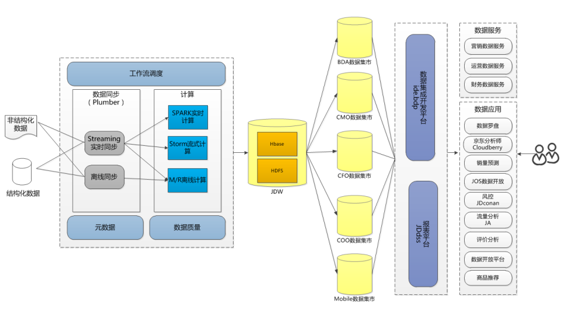

## 5. 技术架构

最最底层的架构

### 5.1 基础架构

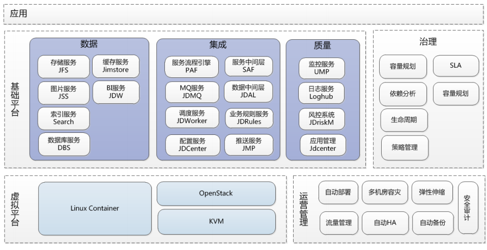

### 5.2 系统运行时原则

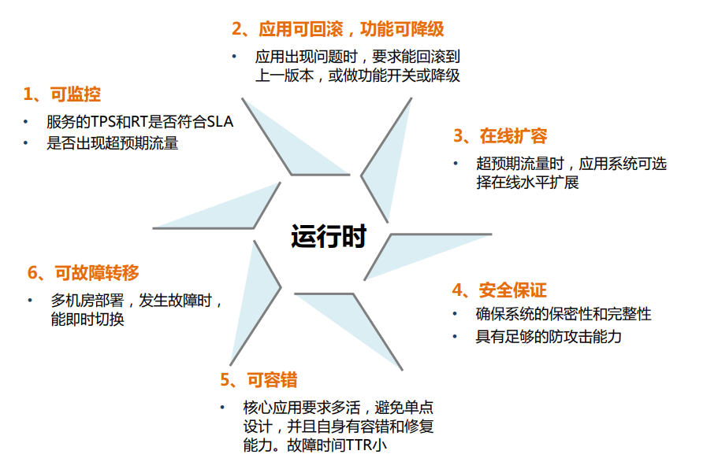

### 5.3 系统部署原则

