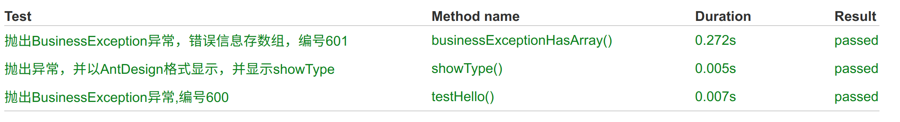

# 统一异常处理

异常处理是由框架统一处理的。对异常做了下面单元测试



## 1 异常分类

- 如果是权限的异常，请抛出`AuthorizeException`
- 如果是业务异常，抛出`BusinessException`

## 2 抛出异常

### ① 多语言

以 Controller 为例，演示通过 Code 值抛出 600 异常的方法

```java
throw new BusinessException(messageUtil.getMessage("welcome",null,"缺省字符串"));
```

返回信息

```json
{
  "status": 600,
  "error": "Business Error",
  "message": "参数无效",
  "path": "/result/exception",
  "exception": "com.wukong.core.exceptions.BusinessException",
  "errors": null,
  "timestamp": "2018-05-31T09:42:11.224+0000"
}
```

### ② 异常变量列表

通过带异常变量列表的方式来抛出 601 异常。

```java
//抛出COMM_PARAM_IS_INVALID(30101, "参数无效"),异常。
 @RequestMapping("/exception")
 public String exception1() {
        //构造一个HashMap用于存放违反规则的变量与提示信息
        Map p=new HashMap();
        //将变量名作为Key，提示信息作为Value存入Map中
        p.put("email","不是一个合法的电子邮件地址");
        p.put("name","长度需要在6和50之间");
        //将p作为参数抛出
        throw new BusinessException(p);
    }

```

返回信息，该 Controller 的返回结果如下(其中 errors 与标注格式还存在一定区别，有待进一步优化)。

```json
{
    "status": 601,
    "error": "Bad Request",
    "message": "参数无效",d
    "path": "/result/exception",
    "exception": "com.wukong.core.exceptions.BusinessException",
    "errors": {
        "name": "长度需要在6和50之间",
        "email": "不是一个合法的电子邮件地址"
    },
    "timestamp": "2018-05-31T09:41:16.461+0000"
}

```

## 3 配置 ShowType

针对 AntDesign 的返回结果，第二个参数是`showType`， antDesignPro 会根据这个来判断，错误的提示方法

```java
throw BusinessException.myBuilder("aaaa",2);
```

AntDesign 中定义可选的数值有：

```
error display type： 0 silent; 1 message.warn; 2 message.error; 4 notification; 9 page
```

## 4 400 异常详解

关于 400 错误的四种异常抛出情形

1. ConstraintViolationException  
   违反约定异常，常见于对数据库的操作。
   例如插入重复的主键，找不到对应的模型，实体属性的值和数据库实际类型不一致等
2. HttpMessageNotReadableException  
   参数传送的请求无法正常处理，常见于字符串格式不正确，无法识别为对应的实体或 Json 对象。
3. BindException  
   数据绑定时发生异常，因为发送的数据与接收时使用的变量格式无法匹配。  
   例如接收时需要数据，但发送的数据是字符串。
4. MethodArgumentNotValidException  
   违反参数校验的异常，抛出此类型。

## 5 自定义异常

大部分情况，步需要自定义异常，如果需要，请按照下面步骤执行：

1：继承`BaseException`

2：修改`GlobalExceptionHandler`
