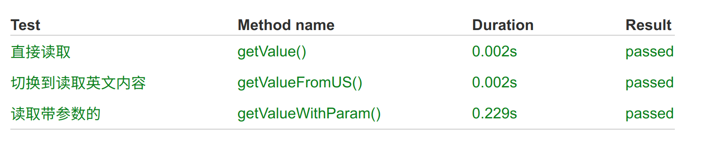
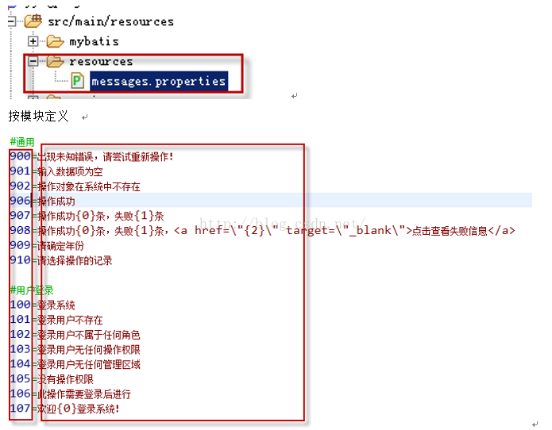

# 实现多语言

使用`messageUtil` 获取多语言。 多语言的功能不常用，这里简单的说明一下。 如果不作为多语言，这里也可以把提示的语言配置到外部文件中，便于修改。

本模块做了 junit 单元测试



## 1 配置多语言

### 1.1 文件说明

| 文件及目录              | 说明                                                                                   |     |
| ----------------------- | -------------------------------------------------------------------------------------- | --- |
| I18nConfig.java         | implements WebMvcConfigurer 多语言配置文件                                             |     |
| LanguageController.java | controller 类，有两个函数 changeSessionLanauage 与 welcome                             |     |
| application.properties  | 配置 il8n 文件                                                                         |     |
| il8n 目录               | messages 文件：messages.properties messages_en_US.properties messages_zh_CN.properties |     |

> 默认是 messages_zh_CN.properties ，只有在 US 与 CN 文件中找不到，才到这个文件找

配置文件示例

```properties
###messages_zh_CN.properties
welcome=你好
optionMessage=成功操作{0}条，失败{1}条

###messages_en_US.properties
welcome=hello welcome
optionMessage={0} successful operations, {1} failed operations

```

### 1.2 修改配置文件

application.properties 配置内容，这步必须做

```properties
#设置国际化配置文件存放在classpath:/i18n目录下
spring.messages.basename=i18n/messages
#设定message bundles编码方式，默认为UTF-8
spring.messages.encoding=UTF-8
```

## 2 使用多语言

通过 messageUtil.getMessage()三种方法得到数据

- getMessage("key")
- getMessage("key{0}is{1}",Object[2])
- getMessage("key{0}is{1}",Object[2],"缺省字符串")

> 上面应该有四个函数，缺了一个，另外这个函数需要优化

在代码中有一个测试用例，里面写了如何使用多语言。

```java
@SpringBootTest
public class TestI18n {
    @Autowired
    private LocaleMessageSourceUtil messageUtil;
    @Test
    @DisplayName("直接读取内容")
    public void getValue(){
        String expectValue="你好";
        String welcome = messageUtil.getMessage("welcome");
        Assertions.assertEquals(welcome,expectValue);
    }
    @Test
    @DisplayName("读取带参数的内容")
    public void getValueWithParam(){
        String expectValue="成功操作100条，失败2条";
        Integer[] array={100,2};
        String actualValue = messageUtil.getMessage("optionMessage",array);
        Assertions.assertEquals(actualValue,expectValue);
    }
    @Test
    @DisplayName("读取英文内容")
    public void getValueFromUS(){
        String expectValue="hello welcome";
        String welcome = messageUtil.getMessage("welcome"
                ,null,null,new Locale("en", "US"));
        Assertions.assertEquals(welcome,expectValue);
    }
}
```

## 3 切换语言

```shell
http://127.0.0.1:8080/welcome
## 输出：你好
http://127.0.0.1:8080/changeLanguage?lang=en
## 切换到 英文
http://127.0.0.1:8080/welcome
## 输出：welcome
```

## 4 key 命名规则

当前有两种命名方法，一种用数字命名，一种用英文名字命名。 推荐使用英文

### 数字命名法

    优势：命名简单
    缺点：通过名字不知道key的含义



### 英文命名法

    优势：在代码中，通过英文名，可以大概才到message的内容
    缺点：起名的时候花时间，英文不熟悉时，也看不懂
