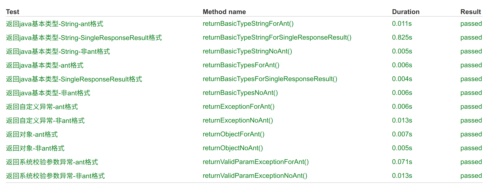

# 定义接口返回值格式

今后只要是新开发的系统，都使用 AntDesign 可以接受的返回值格式。

- 系统重新定义了 rest API 返回值的内容。
- 可以根据不同的配置，按照不同的格式进行返回。
- 这里推荐使用 antDesign 标准的返回值。
- 但是也支持其他格式的返回值，系统中撰写了 junit 的代码，把不同格式的返回值，都用单元测试的代码演示了以便。

这个模块已经进行了 junit 测试，在测试代码中可以看到具体的用法。



## 1. AntDesign 格式

今后会统一使用 `AntDesign` 的返回格式，需要修改配置文件，并加上注解`@AntdResult`就可以了。

### 1.1 使用方法

#### ① 修改配置文件

为了与老版本兼容，需要启用 antDesign 的返回格式。

```yml
wukong:
  core:
    response: antd
```

#### ② 添加注解

追加`@AntdResult`

> 基本对象

```java
    @AntdResult
    @RequestMapping("/test")
    public Integer test(){
       return 1;
    }
```

结果

```json
{ "data": 1, "success": true }
```

> Java 对象

```java
    @AntdResult
    @RequestMapping("/test2")
    public Admin test2(){
        Admin admin = new Admin();
        admin.setAdminGid(1);
        admin.setAdminName("fanhl");
        return admin;
    }
```

结果

```json
{
    "data":{adminName":"fanhl","adminGid":1},
    "success":true
}
```

③ 分页列表

通过`AbstractListResponse` 来返回相应的格式，如果`response: antd` 那么就按照`antdesign`的格式返回。

```java
    @AntdResult
    @RequestMapping("/list")
    public AbstractListResponse<Admin> list(){
        AbstractListResponse ren = adminService.selectAllByPage(1,10);
        return ren;
    }
```

### 1.2 AntDesign 格式

#### ① 格式说明

```json
export interface response {
  success: boolean; // if request is success
  data?: any; // response data
  errorCode?: string; // code for errorType
  errorMessage?: string; // message display to user
  showType?: number; // error display type： 0 silent; 1 message.warn; 2 message.error; 4 notification; 9 page
  traceId?: string; // Convenient for back-end Troubleshooting: unique request ID
  host?: string; // onvenient for backend Troubleshooting: host of current access server
}
```

#### ② 普通例子

```json
{
  "success": true,
  "data": {},
  "errorCode": "1001",
  "errorMessage": "error message",
  "showType": 2,
  "traceId": "someid",
  "host": "10.1.1.1"
}
```

#### ③ 分页

这里只给出了`data`里面的格式定义

```json
{
   list: [
   ],
   current?: number,
   pageSize?: number,
   total?: number,
}
```

## 2. 老系统

为了兼容很久以前开发的程序，今后这种格式的返回值会被废弃。

有三种返回的格式。

- 将原始值返回
- 在【原始值】外再包裹一个 AntDesign 定义的格式
- 关于 List 分页的返回格式有两种，其中一种为了兼容老的项目，可以通过 key 来进行切换
  - [list、total、current、pageSize] 老的格式
  - [current、pageSize、total、success、data] Ant 的格式

### 2.1 使用方法

就按照 SpringBoot 的默认的方法做就行，不用什么单独的操作。

### 2.2 使用规范

建议基础类型加 @SingleResponseResult()注解。 这个功能只在老的项目中用到，新的项目，统一都使用上了 antDesign 的功能了。

| 功能           | 返回值      | 说明                                                       | 注解            |     |
| -------------- | ----------- | ---------------------------------------------------------- | --------------- | --- |
| insert 添加    | long        | 负数:错误,0:没有添加成功，正数：主键(如果是联合主键返回 1) | 加注解返回 json |     |
| delete 删除    | int         | >=0:删除的记录数，<0:表示错误                              | 加注解返回 json |     |
| update 更新    | int         | >=0:更新的记录数，<0:表示错误                              | 加注解返回 json |     |
| count 记录总数 | long        | >=0:返回的记录数                                           | 加注解返回 json |     |
| 是否           | int         | 1:true,0:false,-1:错误                                     | 加注解返回 json |     |
| 返回 String    | String      | 字符串                                                     | 加注解返回 json |     |
| select         | List 或对象 | json 字符串                                                | 无注解返回 json |     |

为了方便读取，返回一个 result 的 json 字符串

```json
{ "result": 666 }
```

### 2.3 返回结果

①②③④⑤⑥⑦⑧⑨⑩⑪⑫⑬⑭⑮⑯⑰⑱⑲⑳✕✓✔✖

#### ① 成功返回结果

| 分类     | 具体类型                                     | 说明        |     |
| -------- | -------------------------------------------- | ----------- | --- |
| 基础类型 | int long Integer Long BigDecimal Date String | 直接输出    |     |
| 对象     | Map User Object                              | json 字符串 |     |

#### ② 分页的返回结果

请求中有两个参数 pageSize currentPage

返回结果

```java
@RequestMapping("/getCityList1")
public ListResponseResult getCityList1() {
    City city1=new City(1,"city1","001");
    City city2=new City(2,"city2","002");
    City city3=new City(3,"city3","003");
    List<City> cityList=Arrays.asList(city1,city2,city3);
    return new ListResponseResult(cityList,100L,10,1);
}
```

```json
{
  "list": [
    { "id": 1, "name": "city1", "code": "001" },
    { "id": 2, "name": "city2", "code": "002" },
    { "id": 3, "name": "city3", "code": "003" }
  ],
  "pagination": { "total": 100, "pageSize": 10, "current": 1 }
}
```

#### ③ 基础类型输出结果

```youtrack
name:123456;email:123@189.cn;cellPhone:123;
```

在基础类型上添加注解

```java
@RequestMapping("/num1")
@SingleResponseResult()
public int  num1() {
    return 666;
}
```

> 输出 json 结果

```json
{ "result": 666 }
```

#### ④ json 输出结果

```json
{ "id": 1, "name": "city1", "code": "001" }
```

#### ⑤ 异常返回结果

> Sringboot 默认的返回结果

- 使用参数校验框架的返回结果

```json
{
  "timestamp": "2018-05-24T06:31:51.423+0000",
  "status": 500,
  "error": "Internal Server Error",
  "message": "para1.name: 长度需要在6和50之间, para1.email: 不是一个合法的电子邮件地址",
  "path": "/result/para"
}
```

- 异常的抛出结果

```json
{
  "timestamp": "2018-05-24T06:36:09.686+0000",
  "status": 500,
  "error": "Internal Server Error",
  "message": "No message available",
  "path": "/result/exception"
}
```

[HTTP 状态码](http://www.runoob.com/http/http-status-codes.html)
