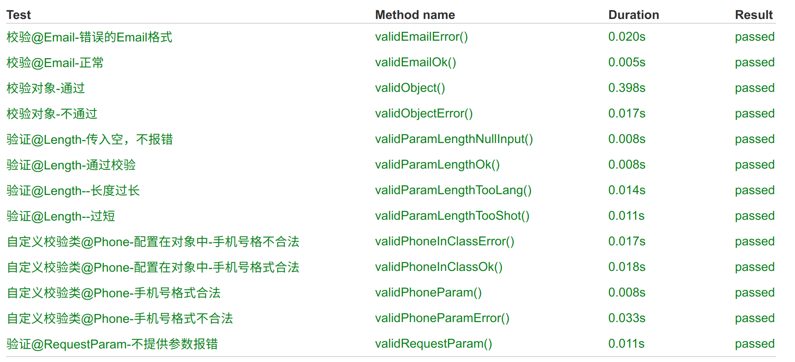

# 校验接口的参数

下面主要是在 Controller 上进行校验。本模块进行了下面的 junit 单元测试

- 正常校验示例



- 不直接抛出校验错误，根据逻辑自己处理后，再决定那些校验要抛出


## 1. 校验函数参数

### ① Class 添加@Validated

- Class 添加@Validated
  - 注意，只要在函数的参数校验时添加，在校验一个 Post Json 对象内部数值时不能添加。

### ② 参数上添加注解

- 在参数上添加注解
  - @Length(min = 6,max = 50) name 长度要在 6 到 50 之间
  - @Email 需要一个合法的 email 地址

```java
@RestController
@RequestMapping("/validator")
@Validated
public class ValidatorController {

    @RequestMapping("/para1")
    public Map para1(@RequestParam  @Length(min = 6,max = 50)  String name
            ,@RequestParam @Valid @Email String email
            ,@RequestParam String cellPhone
    ) {

        return para(name,email,cellPhone);
    }

    @RequestMapping("/para2")
    @ResponseResult
    public Map para2(@RequestParam  @Length(min = 6,max = 50) String name
            ,@RequestParam   @Email String email
            ,@RequestParam  String cellPhone
    ) {
        return para(name,email,cellPhone);
    }

    private Map para(String name,String email,String cellPhone){
        String str= "name:"+name+";"+"email:"+email+";"+"cellPhone:"+cellPhone+";";
        return new HashMap<String,String>(){{
            put("para", str);
        }};
    }
}
```

<br>

### ③ 错误提示

测试结果(没有加全局错误处理)

```youtrack
2018-03-10 12:26:37.656 ERROR 6524 --- [o-auto-1-exec-7] o.a.c.c.C.[.[.[/].[dispatcherServlet]    : Servlet.service() for servlet [dispatcherServlet] in context with path [] threw exception [Request processing failed; nested exception is javax.validation.ConstraintViolationException: fail.name: 长度需要在6和50之间, fail.email: 不是一个合法的电子邮件地址] with root cause
javax.validation.ConstraintViolationException: fail.name: 长度需要在6和50之间, fail.email: 不是一个合法的电子邮件地址
```

## 2. 校验 Bean 属性

### ① bean 添加校验

```java
@Data
public class City {
    @Range(min = 1, max = 20, message = "id只能从1-20")
    private int id;
    @Length(min = 6,max = 50)
    private String name;
    private String code;
}
```

### ② 函数上添加校验

在 controller 类上,必须添加@Valid 才有作用

- 注意所在的类上不能添加`@Validated`

```java
@RequestMapping("/bean2")
public City bean2(@RequestBody @Valid City city) {
    return bean(city);
}
```

### ③ 错误提示

返回的错误信息例子

```json
{
  "status": 400,
  "error": "Bad Request",
  "message": "参数无效",
  "code": 10001,
  "path": "/validator/bean2",
  "exception": "org.springframework.web.bind.MethodArgumentNotValidException",
  "errors": [
    {
      "fieldName": "id",
      "message": "id只能从1-20"
    },
    {
      "fieldName": "name",
      "message": "长度需要在6和50之间"
    }
  ],
  "timestamp": "2018-03-12T03:34:09.653+0000"
}
```

<br>

## 3. 函数内校验

如果想强行捕获错误，进行处理，可以抛出错误，也可以不抛出错误。

在接口处@Validated 添加 BindingResult,可以在函数体内得到错误信息。

```java
@RequestMapping("/method2")
public String method2(@RequestBody @Validated  City city
        ,BindingResult result
) {

    if(result.hasErrors()) {
        List<ObjectError> list = result.getAllErrors();
        for (ObjectError error : list) {
            System.out.println(error.getCode() + "---" + error.getArguments() + "---" + error.getDefaultMessage());
        }
    }
    return city.getName()+"ok";
}
```

_@Validated 与@Valid 是有区别的,建议用@Valid 直接抛出异常_

[这里有一个网友的说明](https://blog.csdn.net/soulofball/article/details/112011877)

## 4. 自定义校验

在`com.wukong.core.validator`中自己定义了`phone`与`url` 两个自定义的方法。

```java
public class PhoneValidator implements ConstraintValidator<Phone, String> {
    private Pattern pattern = Pattern.compile("1(([38]\\d)|(5[^4&&\\d])|(4[579])|(7[0135678]))\\d{8}");

    @Override
    public void initialize(Phone phone){
    }

    @Override
    public boolean isValid(String value, ConstraintValidatorContext constraintValidatorContext){
        return pattern.matcher(value).matches();
    }
}
```

## 5. 常用 Validator

> 常用 validator

| 名称         | 说明                                                            |     |
| ------------ | --------------------------------------------------------------- | --- |
| @null        | 验证对象是否为空                                                |     |
| @notnull     | 验证对象是否为非空                                              |     |
| @asserttrue  | 验证 boolean 对象是否为 true                                    |     |
| @assertfalse | 验证 boolean 对象是否为 false                                   |     |
| @min         | 验证 number 和 string 对象是否大等于指定的值                    |     |
| @max         | 验证 number 和 string 对象是否小等于指定的值                    |     |
| @decimalmin  | 验证 number 和 string 对象是否大等于指定的值，小数存在精度      |     |
| @decimalmax  | 验证 number 和 string 对象是否小等于指定的值，小数存在精度      |     |
| @size        | 验证对象（array,collection,map,string）长度是否在给定的范围之内 |     |
| @digits      | 验证 number 和 string 的构成是否合法                            |     |
| @past        | 验证 date 和 calendar 对象是否在当前时间之前                    |     |
| @future      | 验证 date 和 calendar 对象是否在当前时间之后                    |     |
| @pattern     | 验证 string 对象是否符合正则表达式的规则                        |     |
| @Email       | 验证邮箱                                                        |     |

> 例子说明(regexp 表达式比较好用)

- @size (min=3, max=20, message="用户名长度只能在 3-20 之间")
- @size (min=6, max=20, message="密码长度只能在 6-20 之间")
- @pattern (regexp="[a-za-z0-9._%+-]+@[a-za-z0-9.-]+\\.[a-za-z]{2,4}", message="邮件格式错误")
- @Length(min = 5, max = 20, message = "用户名长度必须位于 5 到 20 之间")
- @Email(message = "比如输入正确的邮箱")
- @NotNull(message = "用户名称不能为空")
- @Max(value = 100, message = "年龄不能大于 100 岁")
- @Min(value= 18 ,message= "必须年满 18 岁！" )
- @AssertTrue(message = "bln4 must is true")
- @AssertFalse(message = "blnf must is falase")
- @DecimalMax(value="100",message="decim 最大值是 100")
- @DecimalMin(value="100",message="decim 最小值是 100")
- @NotNull(message = "身份证不能为空")
- @Pattern(regexp="^(\\d{18,18}|\\d{15,15}|(\\d{17,17}[x|X]))$", message="身份证格式错误"

## 6. 国际化

### ① 添加语言文件

例如：class 目录添加两个文件 。**必须用 ValidationMessages 开头**

> ValidationMessages.properties

```
demo.name = 名字不能为空
```

> ValidationMessages_en.properties

```
demo.name = name is not empty.
```

### ② 使用语言文件

注解中加入{demo.name}

```java
@NotEmpty(message="{demo.name}")
```

## 7. 参考文档

- [使用 validator-api 来验证 spring-boot 的参数](https://www.cnblogs.com/mawang/p/6767906.html?utm_source=itdadao&utm_medium=referral)
- [Spring Boot Validator 校验](http://412887952-qq-com.iteye.com/blog/2312356)
- [Spring Boot 入门 - 基础篇（12）- 数据校验](http://rensanning.iteye.com/blog/2357373)
