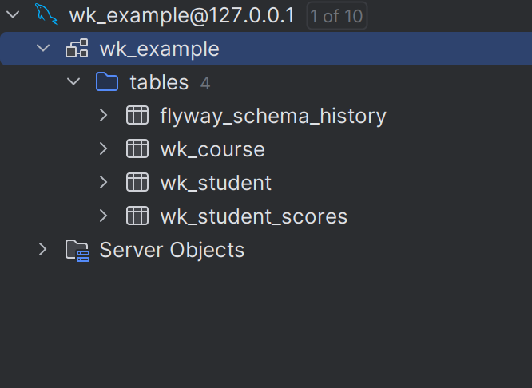

# 集成 Flyway

Flayway 是一款数据库版本控制管理工具，，支持数据库版本自动升级。

为什么把 FlyWay 放在开始位置呢？ 因为这一步可以生成数据库，后续的所有步骤，都是根据这一步来的。

- 常见的错误，用 Sql 已经生成数据库了，但是有该了 Sql 语句，这时候一启动程序或执行操作，系统就报错。解决方法有：
  - 将 Flyway 设置成失效。
  - 如果是开发环境，把库删除了，重新建立一个数据库。

## 1、快速上手

Flyway 已经深度集成到 SpringBoot 中了，基本上不用什么配置，就可以使用 Flyway 了。

### 1.1 准备数据库

确保你的 Mysql 数据库是可以连接的。例如下面手工创建一个测试的数据库。

```sql
create database wk_example
```

### 1.2 添加依赖

单独建立了一个`flyway.gradle`文件。这样在整个工程中的项目都可以引用这个文件。

```groovy
dependencies {
    implementation "org.flywaydb:flyway-mysql"
    implementation "org.flywaydb:flyway-core"
}
```

- 不需要引入 plugin
- 不要需要版本，如果你的项目中用了 SpringBoot 的插件：`io.spring.dependency-management`

在你的项目 gradle 中引用：

```groovy
apply from: rootProject.file("gradle/flyway.gradle")
```

### 1.3 配置 application.yml

这里不用配置 flyway 的内容，只用配置`spring.datasource`就可以了。如果想深度配置`flyway`，那么看后面的内容。

```groovy
spring:
  datasource:
    driver-class-name: com.mysql.cj.jdbc.Driver
    password: 123
    url: jdbc:mysql://127.0.0.1:3306/wk_example?useUnicode=true&characterEncoding=utf8&useSSL=false&serverTimezone=Asia/Shanghai
    username: root
```

- 如上面配置文件，数据库中一定提前建立了`wk_example`。 不然会报错，系统提示找不到数据库。

### 1.4 放入数据库脚本

在`wukong-boot-db`中建立`db`目录，然后在`db`目录下建立`migration`目录。最后在这个目录下填写 Sql 脚本。

文件名是`V1__Create_student_table.sql` 。这个测试的文件可以在`wukong-boot-db工程下test下的resource.db.migration`中找到。

- 关于数据库脚本的文件名定义，可以看`flyway`官方的文档。
- `Mysql`新的版本中，用`utf8mb4`代替了`utf8`

### 1.5 自动生成数据库

启动程序，会自动生成数据库。



- 在 Sql 文件中会建立 3 个表。
- `flyway_schema_history` 是 flyway 自带的表

## 2、其他注意事项

### 2.1 未连接数据库报错

这是一个低级错误，没有执行下面创建数据库的步骤，就启动了程序。

```sql
create database wk_example
```

然后系统提示下面的错误，下面的提示会以为你的 Mybatis 配置错误了，会把你引入误区。

```
Caused by: org.springframework.beans.factory.UnsatisfiedDependencyException: Error creating bean with name 'dbService': Unsatisfied dependency expressed through field 'selectMapper': Error creating bean with name 'selectMapper' defined in file [/home/fanhl/01-java/wukong/wukong-framework/wukong-boot/wukong-boot-db/build/classes/java/main/com/wukong/db/controller/dao/SelectMapper.class]: Cannot resolve reference to bean 'sqlSessionTemplate' while setting bean property 'sqlSessionTemplate'
```

**最简单的解决方案**

`application.yml`文件中添加下面配置，会自动`create database`。 当然你也可以手工配置。

```groovy
context:
  initializer:
    classes: com.wukong.db.initializer.CheckDbInitializer
```

### 2.2 项目开始不使用 Flyway

- 在项目初始阶段，SQL 文件变更比较频繁，着时候建议不使用 Flyway
  - 比如你要添加一个字段，还要写 altet 脚本，还如果删除那个表，重新建立一张新表方便。
- 等项目的 Sql 文件基本固定了，再使用 Flyway。

### 2.3 编写 sql 文件

文件需要放在 `db/migration` 目录下。 更多的内容参考官网。

V1\_\_Create_student_table.sql


- V 为固定前缀分隔符，代表数据库版本化；
- 2*1 为 SQL 脚本版本，’*’ 翻译为小数点，2_1 即为 2.1 版本；
- \_\_为两个下划线，代表中间分隔符；
- init_request 为 SQL 脚本名，概述本脚本要进行的操作；
- .sql 为固定后缀。

### 2.4 Flyway 参数配置

Flyway 的其他参数配置

```yml
spring:
  flyway:
    baseline-version: 1 # 开始执行基准迁移时对现有的schema的版本打标签，默认值为1.
    baseline-description: first migration # 对执行迁移时基准版本的描述
    baseline-on-migrate: true # 当迁移时发现目标schema非空，而且带有没有元数据的表时，是否自动执行基准迁移，默认false.
    check-location: true # 检查迁移脚本的位置是否存在，默认false.
    clean-on-validation-error: false # 当发现校验错误时是否自动调用clean，默认false.
    encoding: UTF-8 # 设置迁移时的编码，默认UTF-8.
    ignore-future-migrations: true # 在读取模式历史记录表时是否忽略将来的迁移。
    init-sqls: # 当初始化好连接时要执行的SQL.
    out-of-order: false # 是否允许无序的迁移，默认false.
    placeholder-prefix: # 设置每个placeholder的前缀，默认${.
    placeholder-suffix: # 设置每个placeholder的后缀，默认}.
    schemas: # 设定需要flyway迁移的schema，大小写敏感，默认为连接默认的schema.
    sql-migration-prefix: # 迁移文件的前缀，默认为V.
    sql-migration-separator: # 迁移脚本的文件名分隔符，默认__
    sql-migration-suffixes: # 迁移脚本的后缀，默认为.sql
    table: # 使用的元数据表名，默认为schema_version
    validate-on-migrate: true # 迁移时是否校验，默认为true.
```

## 3、参考文档

> 参考文档

- [Flyway 说明及使用规范](https://blog.csdn.net/beautyofmath/article/details/106194433)
- [flyway 官网](https://flywaydb.org/)
