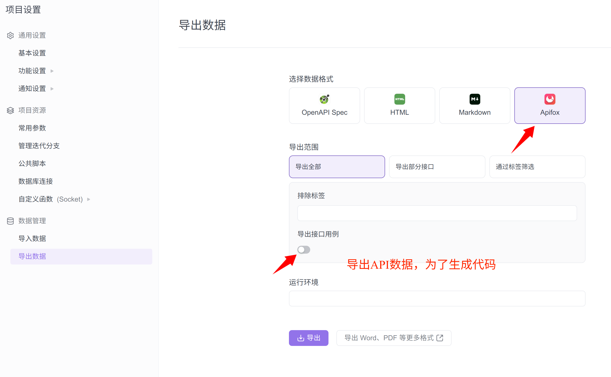

# 生成代码

生成前台与后台的代码：

* 后台代码
  * Server层，这部分内容是根据myBatis来生成的
  * Controller层，这部分内容是根据`Apifox`来生成的。那么能省下来那些方法呢？
    * url地址
    * 参数，如果是get，那么放入到一个map中。如果post，那么就存放到一个对象中。
    * 返回数值，这个有点难，如是正常基础类型或者数据库的基本类型，就直接返回。 如果是其他的，可能要返回一个map
* 前台代码
  * data.ts定义，从数据库中取出来进行定义。
  * service定义
  * 编辑框与列表框


这里简单描述一下自动生成的目录结构与使用方法

- [github 官网](https://github.com/mybatis/generator)
- [mybatis generator 官方参考文档](http://www.mybatis.org/generator/)
- [MyBatis Generator generatorConfig.xml 配置详解](https://blog.csdn.net/luobing_csdn/article/details/66969481)





## 1. 如何生成

使用步骤如下

### 1.1 修改配置文件

修改`config.properties`，主要修改的内容如下：

- 要连接的数据库
- 要生成的表
- 要生成的包

### 1.2 执行生成

在`idea的Terminal中`执行：

```sh
#执行下面的命令
./gradlew gen2
```

生成的文件在`log`，系统会先删除上次生成的代码，避免重复生成。

生成完毕后，建议去`log`目录中检查一下代码。

生成的代码有：

- model
- dao
- service
- constroller
- test （可选）
- mock.json （可选）

## 2. 生成代码说明

### 2.1 目录结构

生成的代码结构如下，可以按照需要来使用

```shell
├── main
│   └── java
│       └── com
│           └── wukong
│               └── dev
│                   ├── controller
│                   │   └── StudentController.java  # Controller代码
│                   ├── mapper
│                   │   ├── base  # 不建议修改的代码
│                   │   │   ├── StudentDynamicSqlSupport.java
│                   │   │   └── StudentMapper.java
│                   │   └── StudentDao.java # 可以修改的，便于维护
│                   ├── model
│                   │   └── Student.java  # 对象实体类
│                   └── service
│                       ├── base # 不建议修改的代码
│                       │   └── BaseStudentService.java
│                       └── StudentService.java # 可以修改的
└── test
    ├── java
    │   └── com
    │       └── wukong
    │           └── dev
    │               └── controller
    │                   └── StudentControllerTests.java # 自动化测试代码
    └── resources
        └── mock
            └── Student.json  # mock数据

```

### 2.2 代码说明

在下面代码的基础上，可以添加特殊的业务逻辑。

#### 1.2.1 Controller

- 实现了

  - 列表查询（可以分页，指定 where 条件或者排序字段）

  - 根据 ID 查询单条记录

  - 删除某条记录

  - 添加或保存某条记录

```java
@Tag(name="")
@RestController
@RequestMapping("${wukong.mall.admin.api-prefix:/api/admin}/example")
public class StudentController {

    @Autowired
    private StudentService StudentService;

    @Tag(name="XXXX")
    @Operation(summary = "得到AAAA列表：可分页、检索、排序")
    @PostMapping("/getStudentList")
    @AntdResult
    public AbstractListResponse<Student> getStudentList(@RequestBody AntSearchListParams params){
        return StudentService.selectByAntSearchByPage(params);
    }

    @Tag(name="XXXX")
    @Operation(summary = "通过ID得到某个AAAA")
    @GetMapping("/getStudentById")
    @AntdResult
    public Student getStudentById(@RequestParam Integer StudentId){
        return  StudentService.selectById(StudentId);
    }

    @Tag(name="XXXX")
    @Operation(summary = "根据ID删除AAAA")
    @GetMapping("/delStudentById")
    @AntdResult
    public int delStudentById(@RequestParam Integer StudentId){
        return StudentService.deleteByPrimaryKey(StudentId);
    }

    @Tag(name="XXXX")
    @Operation(summary = "新增或更新AAAA")
    @PostMapping("/saveStudent")
    @AntdResult
    public int saveStudent(@RequestBody Student Student){
        return StudentService.insertOrUpdateSelective(Student);
    }

}
```

#### 1.2.2 Service

这是一个空的 Service，以在里面添加不是系统自动生成的方法。

```java
@Service
public class StudentService  extends BaseStudentService {
}
```

#### 1.2.3 Dao

这是一个空的`Dao`，可以在里面添加不是系统自动生成的方法。

```java
@Mapper
public interface StudentDao extends StudentMapper {
}
```

### 2.3 注意事项

- 尽量不修改自动生成的代码，避免每次表结构变更后，Merge 代码的工作。

- 一些复杂的数据库操作与 Controller 操作，见后面的文档说明
