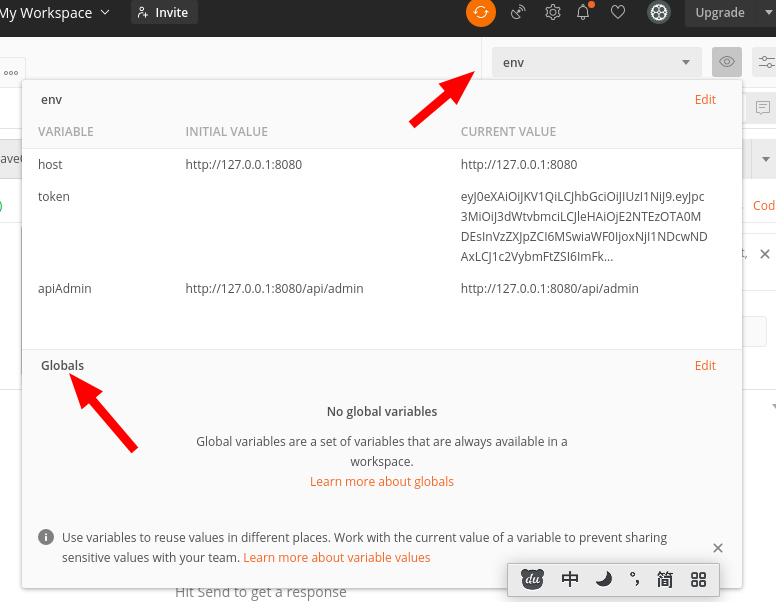
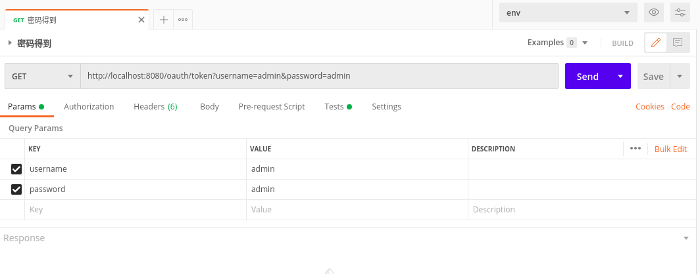
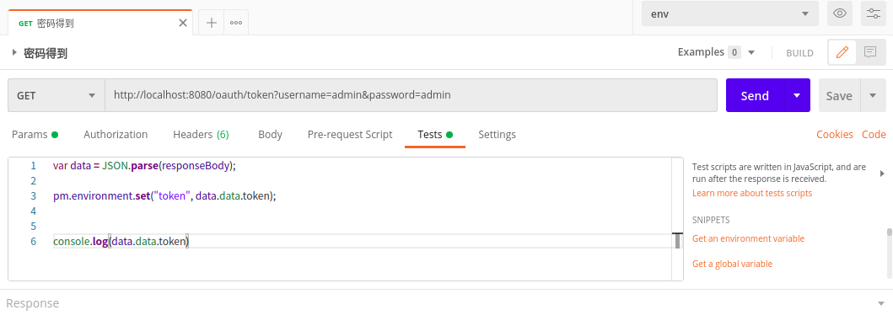
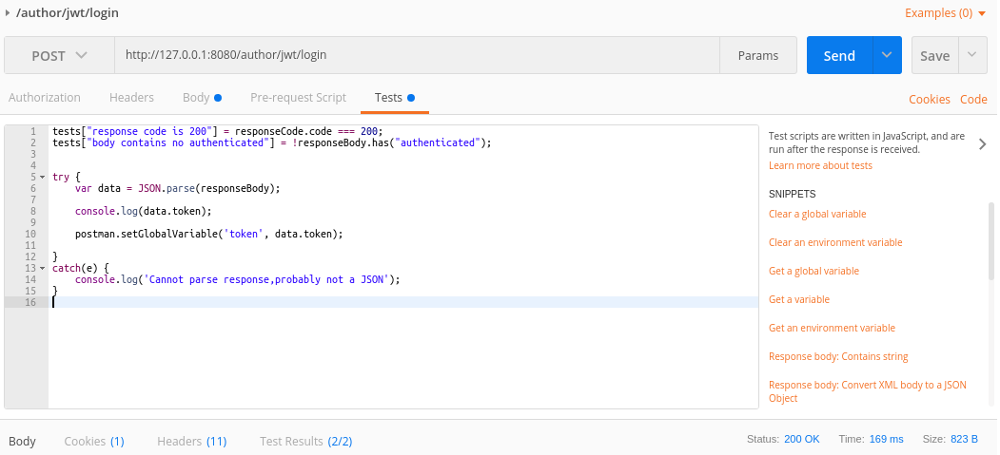
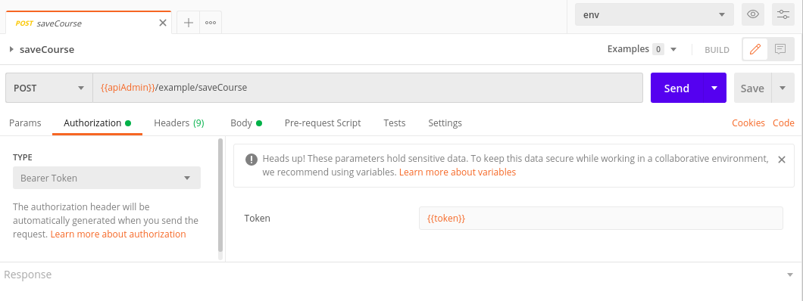
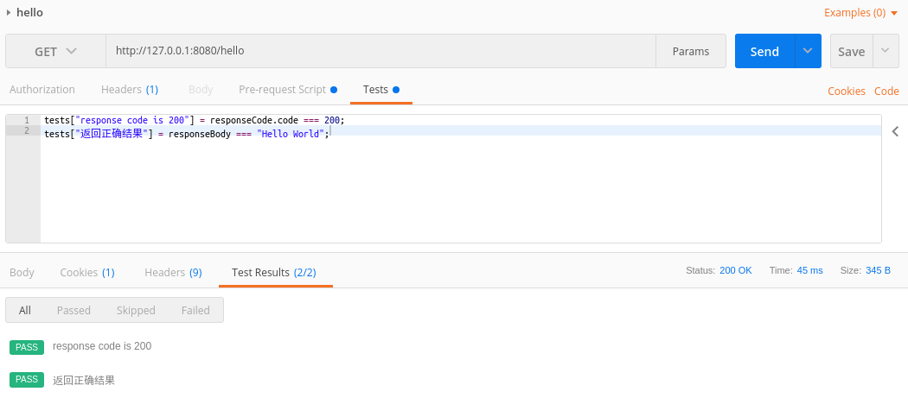

# PostMan

记录了 postMan 的使用方法。 <font color='red'>   PostMan被淘汰了。</font>

①②③④⑤⑥⑦⑧⑨⑩⑪⑫⑬⑭⑮⑯⑰⑱⑲⑳✕✓✔✖

## 1. 得到 Token

通过 login 得到全局 tonken

### 1.1 设置环境变量

可以设置全局或者局部的。局部变量的好处是可以根据不同的测试脚本进行测试。



### 1.2 访问接口

`http://localhost:8080/oauth/token?username=admin&password=admin` 这里配置了用 admin 得 token



### 1.3 保存 Token

有两种方法，都行

#### ① 保存到环境变量



#### ② 保存到全局变量

```
postman.setGlobalVariable('token', data.token);
```



<br>

## 2. 使用 Token

设置 authorization



## 3. 撰写测试用例



<br>

## 4. 注意事项

### 4.1 进行 https 测试

如果不进行下面的设置会报错

setting->General->SSL certificate verification =off

### 4.2 参考资料

- postman 的使用方法详解！最全面的教程
- 讲解了可以从 cvs 中获取
