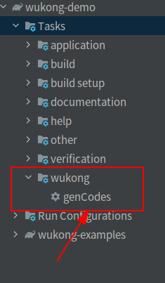
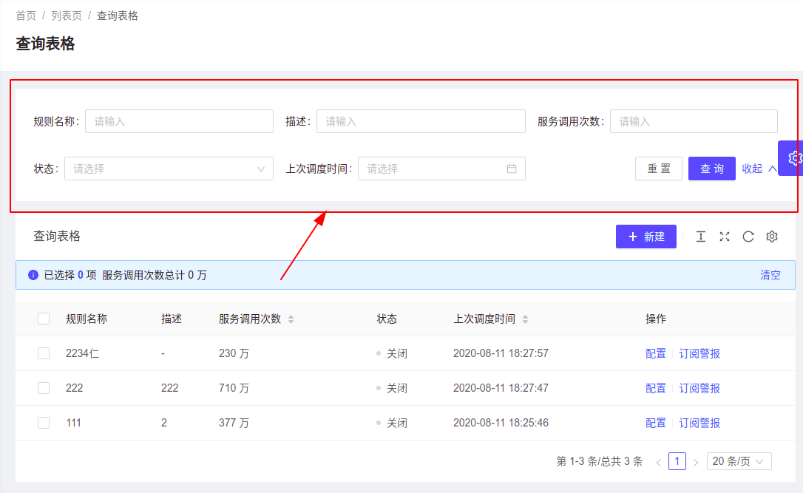
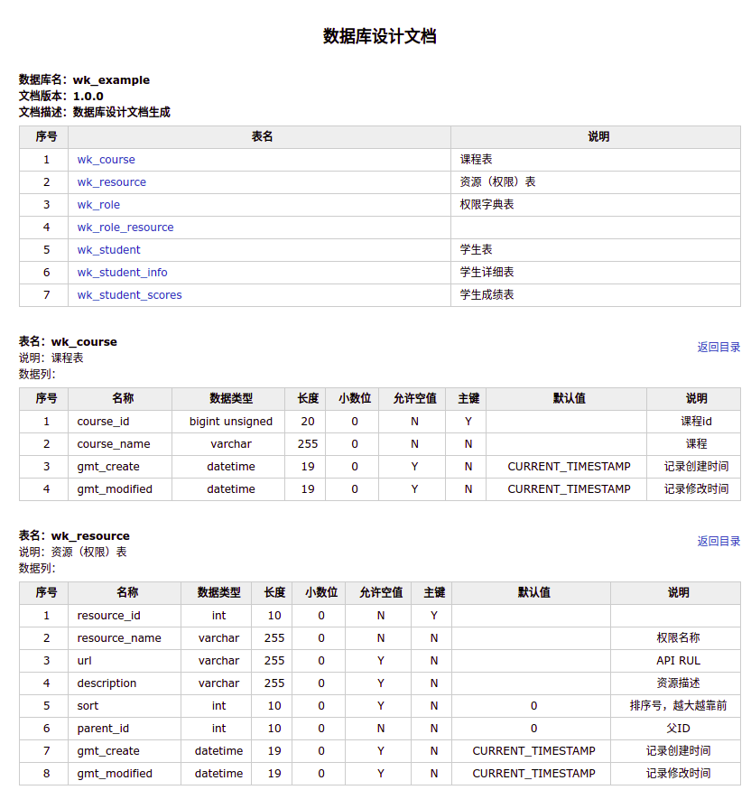

# 🚀开发流程简介

这里用一个简单的案例，描述了如何开发一个模块。

## 1、需求与设计

### 1.1 开发需求

通过如下途径了解需求

- 用例描述
- 制作原型:原型也可以算成一种设计
- 询问与讨论

### 1.2 进行设计

* 数据库设计
  * <font color='red'>现在前端的开发人员已经很强烈了，后台检索尽量不要超过3张表，那些不常更新的字典表就不要关联查询了，让前台做个缓存自己匹配。</font>
  * 有些不经常变更的内容，可以进行冗余设计，避免关联表格进行查询。
  * 这里有一个[阿里的设计规范](https://aifarm.redhtc.com/development#2%E6%95%B0%E6%8D%AE%E5%BA%93%E8%AE%BE%E8%AE%A1%E8%A7%84%E8%8C%83)
* 接口设计，这里推荐使用[apifox来设计接口](https://aifarm.redhtc.com/development/mock-api-specification)
  * 接口设计的规定可以参考上面那个文档。
  * 通过接口设计来验证数据库设计的是否合理。

设计非常非常重要，如果设计做好了，能省下 30%的工作量。
那什么样的设计能达到设计标准呢？

## 2、撰写 Sql

必须手工写`Sql`语句，并且`Sql`语句与代码都收`Git`控制，这样容易跟踪`Sql`语句的变更，不能直接在数据库上修改`Sql`语句。

### 2.1 基本约定

- 定义主键
  - 要加上表明
  - 预计记录超过 1 亿，那么组建用 BIGINT
- 新加与变更字段
  - gmt_create
  - gmt_modified
- 定义唯一索引(可选)
- 定义索引(可选)
- 所有索引必须加上表名

> 示例

```sql
DROP TABLE IF EXISTS wk_student;

create table wk_student (
  student_id     BIGINT unsigned       NOT NULL   AUTO_INCREMENT    COMMENT '学生id',
  student_name   varchar(255)          NOT NULL                     COMMENT '学生姓名',
  student_age    int                                                COMMENT '学生年龄',
  student_sex    int                                                COMMENT '学生性别',
  gmt_create    DATETIME                DEFAULT CURRENT_TIMESTAMP NULL   COMMENT '记录创建时间',
  gmt_modified  DATETIME                DEFAULT CURRENT_TIMESTAMP NULL   COMMENT '记录修改时间',
  PRIMARY KEY (student_id),
  UNIQUE KEY `wk_student_unique` (`student_name`)
) ENGINE=InnoDB AUTO_INCREMENT=10000 DEFAULT CHARSET=utf8mb4 COMMENT='学生表';
```

### 2.2 进行测试

先在一个测试库上测试一下是否有语法错误。

### 2.3 追加 flyway

如果在项目中使用了 flyway 的版本控制，那么还要麻烦一点。文件需要放在 db/migration 目录下

**V1\_\_Create_student_table.sql**

- V 为固定前缀分隔符，代表数据库版本化；
- 2*1 为 SQL 脚本版本，’*’ 翻译为小数点，2_1 即为 2.1 版本；
- \_\_为两个下划线，代表中间分隔符；
- init_request 为 SQL 脚本名，概述本脚本要进行的操作；
- .sql 为固定后缀。

## 3、生成基础代码

这里是按照数据库的结构生成代码，未来可以按照`APIFox`的接口内容，生成`Controller`。

[这里有生成代码的详细步骤与文件说明](/development/gen-code)

- 生成代码
- 测试代码
  - 将生成的代码复制到项目中，执行`build`，在代码中有自带的单元测试脚本，如果通过就表示脚本没有问题。

在`plugin`中修改`config.properties`，然后执行`genCodes`来生成代码，生成的代码放在`/log`中



生成的代码有：model、dao、service、controller、test，可以只用一部分，也可以全用。


## 4、写接口代码

按接口文档写Controller，Controller要实现的主要内容有：

* 进行权限验证，虽然有争议，权限验证就不放在service中了。
* 前台传入的参数校验。

业务逻辑的内容，统一都放在`service`层中。


## 5、写service代码

* service层大部分是撰写数据库操作代码，所以下面主要介绍表的操作。

* dao层代码就不用写了。

### 5.1 单表操作

- [99%单表操作都封装了](/development/database)
- [也可以使用 mybatis 提供的接口](/development/database-my-batis-dynamic)

### 5.2 复杂 Sql 查询

有两种方法，推荐前两种

#### ① 直接写 Sql 语句

```java
public List<Map> selectUser(){
	String sql="select * from user where userid=123";
    return selectMapper.select(sql);
}
```


#### ② 使用 mybatis-dynamic-sql

[官网使用说明](https://mybatis.org/mybatis-dynamic-sql/docs/select.html)

```java
    SelectStatementProvider selectStatement = select(orderMaster.orderId, orderDate, orderDetail.lineNumber, orderDetail.description, orderDetail.quantity)
            .from(orderMaster, "om")
            .join(orderDetail, "od").on(orderMaster.orderId, equalTo(orderDetail.orderId))
            .build()
            .render(RenderingStrategies.MYBATIS3);
```

#### ③ Mapper 写法

Mybatis 最基本的写法，下面是一个例子

```java
@Mapper
public interface AreaDao extends AreaMapper {
    /**
     * 输入where条件，返回一个对象List
     * @param whereClause  where 条件
     * @return List<Area>
     */
    @Select({
            "select * ",
            "from ec_area",
            "${whereClauseProvider.whereClause}",
            " ${orderBy} "
    })
    @ResultMap("AreaResult")
    List<Area> selectByWhere(@Param("whereClauseProvider")WhereClauseProvider whereClause
            ,@Param("orderBy") String orderBy);
}
```


### 5.2 Mybatis 增强

#### ① lambda 的 Sql 语法

[Mybatis 推出新的方法](/database)，效率提高了很多，就像写 Sql 语句一样，在 Java 中自由撰写。

代码生成器生成了基本的添加、删除、查询，还可以在这个基础进行灵活编码。

```java
private boolean checkRoleIds(Integer[] roleIds){
    Long ren = roleDao.count(c-> c.where(roleId,isIn(roleIds)));
    if(roleIds.length>0 && ren.intValue()==roleIds.length){
        return true;
    }
    throw new BusinessException("角色编号在数据库中没有找到:"+ Arrays.toString(roleIds));
}
```

#### ② 分布式主键

为了提高系统效率，使用了数据库读写分离，系统中会对应多个 mysql 数据库。这样就要求分布式主键生成器。

下面的代码，就可以得到一个`雪花`分布式主键

```java
Long snowId=IdUtil.getSnowId();
```

#### ③ 自动填充字段

可以在配置文件中配置，当更新一条记录时，会自动将更新时间记录到相应的字段中。

例如：gmt_modified

```yaml
wukong:
  auto-fill-date-column:
    enabled: true
    columns: gmt_modified,gmt_test
```

#### ④ 自动拼装 Sql

根据前台参数，自动拼接 Sql。

前台一般会有这样的查询界面，按照一定规则，能动态形成查询的 Sql 语句。例子见：DynamicSqlController



#### ⑤ 通用 Mapper

正常情况下，Mybatis 撰写 Sql 操作，要实现 Model,Mapper 操作，这里提供了一个通用 Mapper: `selectMapper`

大大极化了 Sql 操作，只用写 Sql 语句就可以了，就可以把结果传递给前台。

```java
    @RequestMapping("/selectUser")
    public List<Map> selectUser(){
		String sql="select * from user where userid=123";
        return selectMapper.select(sql);
    }
```

#### ⑥ 防止 Sql 注入

使用`SqlSafeUtil`类就可以。


## 6、集成安全框架

集成了 JWT 安全框架。可以直接使用。

### ① 实现了基本功能

登陆、注册、分配权限、删除用户等基本功能。

### ② 不受限配置

有些路径不需要权限认证，可以通过配置文件来配置。

## 7、代码测试

### ① 静态代码检查

静态代码检查在`build/reports/spotbugs`

### ② Junit 单元测试

不写测试脚本的程序员不是好程序员。[Junit 使用可以看这里](/development/test/junit)

## 8、自动化文档

### ① API 接口文档

使用了 spring doc 来输出文档。

### ② 数据库文档



## 9、代码归档

commit 代码，并且 push 到服务器上。

对于比较复杂的代码，使用`stopBug`进行代码检查。

## 10、例子代码

- controller 功能 放在 core 的 test 中了
- db 的功能，放在 db 的 test 中了
