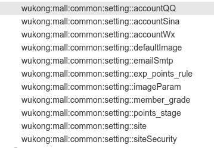

# Redis 使用

推荐客户端：`Another-Redis-Desktop-Manager.1.4.0`

## 1、安装

> 安装 redis 服务器

这里用 docker 来安装一个开发环境，服务端安装与 redis 基本的 cmd 语法，看这个[文档](/development/quick/docker-mysql-redis-mqtt)。

> 安装客户端

直接写 redis 命令是可以的，这里推荐一个免费还好用的客户端。是从 github 上下载，学会科学上网更好，因为 github 网络非常不稳定。

- 打开[AnotherRedisDesktopManager 网址](https://github.com/qishibo/AnotherRedisDesktopManager/releases/)
- 选择最新版本下载
  - ubuntu 操作系统可以选择`.AppImage`结尾文件。
  - 在本地右键，选择可以执行。然后执行，并设置连接方式。

## 2、redis-key 命名规范

### 2.1 非 DB 层

非 DB key 命名规范

    key = wukong:模块名称:缓存名字:主键
        例如tonken缓存的命名 key = wukong:security:token:{userid}

### 2.2 DB 层

DB 层查询 key 命名规范

    1:保存对象
        key= 表名:主键值  value=对象
        例如：user:1=userObject
    2:保存表字段的明细
        key=表名:主键字段名:主键数:字段名  value=字段值
        例如：user:userid:1:username="amdin"
             user:userid:1:email="fanhl@189.cn"
        检索：
             keys user:userid:1* 可以查出有几个属性

## 3、在代码中使用 redis

### 3.1 直接使用 RedisTemplate

> 例如：JwtTokenUtil.java 直接使用 spring RedisTemplate 进行操作

```java
@Autowired
private StringRedisTemplate template;
private final static String REDIS_TOKEN="wukong:security:token:";
//将数据设置到缓存中
private void setTokenToReddis(Integer userid,String token,Date createDate){
    ValueOperations<String, String> ops = template.opsForValue();
    String key=REDIS_TOKEN+userid+":"+getDateStr(createDate);
    ops.set(key,token);
}

//从缓存中得到token
private String getTokenFromRedis(Integer userid,Date createDate){
    //判断如果有缓存，就返回缓存
    ValueOperations<String, String> ops = template.opsForValue();
    String key=REDIS_TOKEN+userid+":"+getDateStr(createDate);
    if(template.hasKey(key)){
        return ops.get(key);
    }
    return "";
}
```

下面给出了一些`RedisTemplate` 常用的方法

| 方法                                                      | 说明                             |
| --------------------------------------------------------- | -------------------------------- |
| RedisTemplate<String,Object> redisTemplate                | 引入保存 Object 的 redisTemplate |
| private StringRedisTemplate template;                     | 引入保存 String 的 redisTemplate |
| redisTemplate.opsForValue().get(redisKey_classTree);      | 根据 Key 得到对象                |
| redisTemplate.opsForValue().set(redisKey_classTree,root); | 设置缓存                         |

### 3.2 使用注解

常用的注解如下

| 注解示例                                              | 说明         |
| ----------------------------------------------------- | ------------ |
| @CacheConfig(cacheNames="wukong:mall:common:setting") | 指定 Key     |
| @Cacheable(key="#p0")                                 | 根据参数生成 |
| @CacheEvict(key="#p0")                                | 根据参数删除 |

#### ① 定义 Key

追加类注解@CacheConfig，来统一指定 Key

```java
@Service
@CacheConfig(cacheNames="wukong:role")
public class RoleService {

}
```

#### ② 添加缓存

方法上追加 @Cacheable

```java
// @Cacheable 会先查询缓存，如果缓存中存在，则不执行方法
@Cacheable(key="#p0")
public List<Role> selectRolesByUserid(Integer userid){
    return roleMapper.selectRolesByUserid(userid);
}
```

如果用注解 redis 的 key 会有一个空格`::`，看下图：


> 为了能给不同的项目添加不同的 redisKey 前缀，security 模块使用了 keyGenerator。今后 security 模块会被 oauth2 代替，下面的代码只作为参考

```java
@Cacheable(cacheNames="wukong:security:user:roles" , keyGenerator= "userRolesKeyGenerator")
public List<Role> selectRolesByUserid(Integer userid){
    return roleMapper.selectRolesByUserid(userid);
}
```

#### ③ 删除缓存

**方法上追加 @CacheEvict**

更新要删除缓存

```java
@CacheEvict(key="#p0")
public int updateSetting(String name,String value){
    Setting setting=new Setting();
    setting.setName(name);
    setting.setValue(value);
    return settingDao.updateByPrimaryKeySelective(setting);
}
```

也可以用一个空方法删除注解

```java
@CacheEvict(key="#p0")
public void  delUserDetailsRedis(String username){
    System.out.println("delUserDetailsRedis:"+username);
}
```

### 3.3 使用 RedisUtils

RedisUtils 不是太成熟，里面只封装了`<String,String>`形式，没有对`<String,Object>`进行封装，所以在使用要谨慎。如果担心有问题，可以直接使用最原始的形式。

```java
/**
     * 清空缓存，指定一个规则可以清空所有符合条件的
     */
public void clearAllClassRedis() {
    Set<String>  keys=  redisUtils.keys(redisKeyRefFix+"*");
    redisUtils.delete(keys);
}
```

## 4、进阶使用

- [Spring 关于 Redis 的各种操作:Spring Data Redis](https://docs.spring.io/spring-data/redis/docs/current/reference/html/#preface)
- [1 分钟快速上手 Spring Cache](https://juejin.cn/post/7067090649245286408)

### 4.1 条件缓存 condition 和 unless

#### condition

有时候，一些值不适合缓存，可以使用 @Cacheable 的 condition 属性判读那些数据不缓存，它接收的是一个 Spel 表达式，该表达式的值是 true 或 false；true，数据被缓存，false 不被缓存。

```java
@Cacheable(key = "#key", condition = "#key.startsWith('glmapper::')")
public String find(String key) {
    System.out.println("execute find...");
    return this.mockDao.find(key);
}
```

key 必须是 `"glmapper::"` 开头的才允许缓存。

#### unless

@Cacheable#unless 一般是对结果条件判读是否进行缓存使用的，这个示例使用的是入参作为判断条件，各位可以自己写一个根据结果进行缓存的示例，切记满足条件是不缓存。Spel #result 变量代表返回值。

```java
@CachePut(unless="#result == null", keyGenerator = "myKeyGenerator")
public String save(String model) {
    System.out.println("execute save...");
    this.mockDao.save(model, model);
    return model;
}
```

## 5、Redis 服务器高级配置

### 5.1 安全设置

- /etc/redis/redis.conf

- [参考网址](https://blog.csdn.net/u011574239/article/details/78892174)

- 绑定只能本地才能访问(默认已经是了)
- 设置访问密码(这个没有做,今后可以做)
- 删除特殊命令

> 配置 redis.conf 中的密码

    cd /etc/redis/
    vim redis.conf
    # 追加一行：  requirepass redisTest
    /etc/init.d/redis-server  stop
    /etc/init.d/redis-server  start

> 登录 redis 时输入密码

    redis-cli
    auth redisTest

### 5.2 高级用法

看这个网址：https://xiaolincoding.com/redis/

- 高可用
- 缓存雪崩、缓存击穿、缓存穿透
- 数据库和缓存如何保证一致性？
- AOF 持久化是怎么实现的？
- 数据类型
  - String（字符串）
    - **应用场景：缓存对象 常规计数(访问次数、点赞、转发、库存数量) 分布式锁 共享 Session 信息**
  - Hash（哈希）
  - List（列表）
    - 应用场景：消息队列 。可以忽略，因为有更好的选择。
  - Set（集合）
    - **应用场景： 点赞 共同关注 抽奖活动**
  - Zset（有序集合）
    - 应用场景：排行榜
  - BitMap（2.2 版新增）
    - **应用场景：签到统计 判断用户登陆态(5000 万用户只需要 6 MB 的空间) 连续签到用户总数**
  - HyperLogLog（2.8 版新增）
  - GEO（3.2 版新增）
    - 应用场景: 滴滴叫车
  - Stream（5.0 版新增）
    - 应用场景: 消息队列设计

#### 滴滴叫车

这里以滴滴叫车的场景为例，介绍下具体如何使用 GEO 命令：GEOADD 和 GEORADIUS 这两个命令。

假设车辆 ID 是 33，经纬度位置是（116.034579，39.030452），我们可以用一个 GEO 集合保存所有车辆的经纬度，集合 key 是 cars:locations。

执行下面的这个命令，就可以把 ID 号为 33 的车辆的当前经纬度位置存入 GEO 集合中：

```shell
GEOADD cars:locations 116.034579 39.030452 33
```

当用户想要寻找自己附近的网约车时，LBS 应用就可以使用 GEORADIUS 命令。

例如，LBS 应用执行下面的命令时，Redis 会根据输入的用户的经纬度信息（116.054579，39.030452 ），查找以这个经纬度为中心的 5 公里内的车辆信息，并返回给 LBS 应用。

```shell
GEORADIUS cars:locations 116.054579 39.030452 5 km ASC COUNT 10
```
